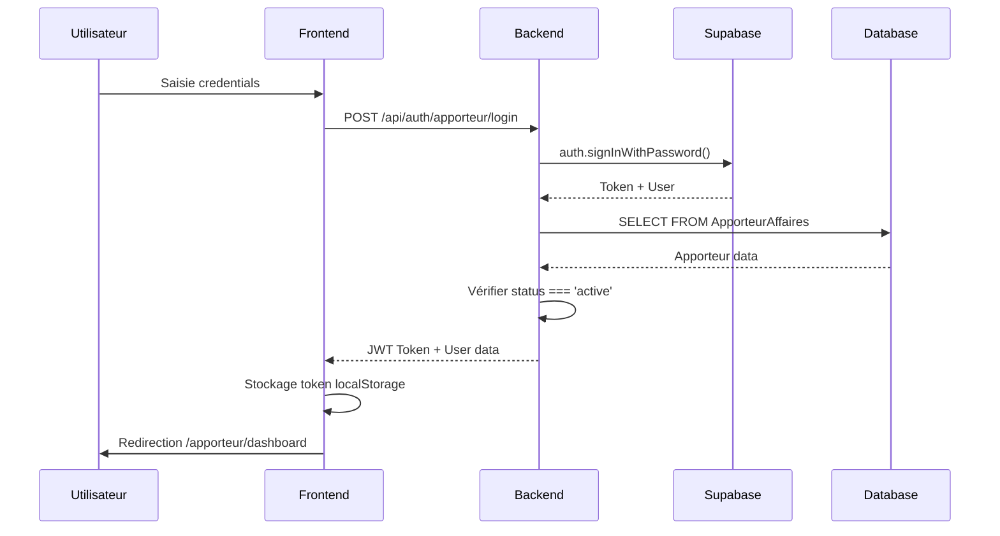
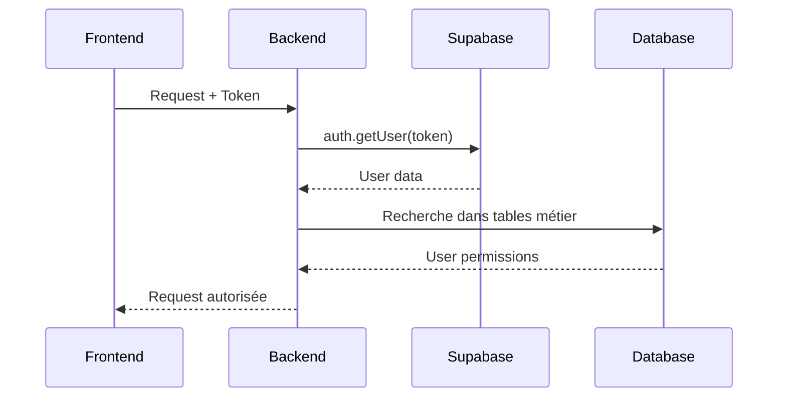

# 🔐 Système d'Authentification - Documentation Complète

## 📋 Vue d'ensemble

Le système d'authentification de Profitum gère 4 types d'utilisateurs :
- **Client** : Accès libre aux simulations
- **Expert** : Validation admin requise (`approval_status: 'approved'`)
- **Apporteur d'affaires** : Validation admin requise (`status: 'active'`)
- **Admin** : Accès complet au système

## 🏗️ Architecture

### Structure des Routes

```
/api/auth/
├── login                    # Route générique (dépréciée)
├── client/login            # Authentification client exclusive
├── expert/login            # Authentification expert exclusive
├── apporteur/login         # Authentification apporteur exclusive
└── verify                  # Vérification token
```

### Middleware d'Authentification

- **`enhancedAuthMiddleware`** : Authentification générale
- **`requireUserType(type)`** : Vérification du type d'utilisateur
- **`clientActivityMiddleware`** : Suivi d'activité client

## 🔧 Implémentation Technique

### Backend (Express.js)

#### Routes d'Authentification (`/server/src/routes/auth.ts`)

```typescript
// Route apporteur exclusive
router.post('/apporteur/login', async (req, res) => {
  // 1. Authentification Supabase
  const { data: authData, error: authError } = await supabase.auth.signInWithPassword({
    email, password
  });

  // 2. Recherche exclusive dans ApporteurAffaires
  const { data: apporteur, error: apporteurError } = await supabase
    .from('ApporteurAffaires')
    .select('*')
    .eq('email', userEmail)
    .single();

  // 3. Vérification statut
  if (apporteur.status !== 'active') {
    return res.status(403).json({
      message: 'Votre compte apporteur d\'affaires n\'est pas encore activé'
    });
  }

  // 4. Génération token JWT
  const token = jwt.sign({
    id: apporteur.id,
    email: userEmail,
    type: 'apporteur_affaires'
  }, process.env.SUPABASE_JWT_SECRET, { expiresIn: '24h' });
});
```

#### Middleware d'Authentification (`/server/src/middleware/auth-enhanced.ts`)

```typescript
export const enhancedAuthMiddleware = async (req: Request, res: Response, next: NextFunction) => {
  // 1. Extraction token
  const token = extractToken(req);

  // 2. Vérification Supabase
  const { data: { user }, error } = await supabase.auth.getUser(token);

  // 3. Recherche utilisateur dans les tables métier
  let userData = await findUserInTables(user.email);

  // 4. Attribution permissions
  req.user = {
    ...userData,
    permissions: getUserPermissions(userData.type)
  };
};
```

### Frontend (React)

#### Hook d'Authentification (`/client/src/hooks/use-auth.tsx`)

```typescript
const login = async (credentials: LoginCredentials) => {
  // Utilisation des services distincts
  let response;
  if (credentials.type === 'client') {
    response = await loginClient(credentials);
  } else if (credentials.type === 'expert') {
    response = await loginExpert(credentials);
  } else if (credentials.type === 'apporteur_affaires') {
    response = await loginApporteur(credentials);
  }

  // Redirection selon le type
  if (response.success) {
    if (credentials.type === 'apporteur_affaires') {
      navigate('/apporteur/dashboard');
    }
    // ... autres redirections
  }
};
```

#### Services d'Authentification (`/client/src/lib/auth-distinct.ts`)

```typescript
export const loginApporteur = async (credentials: LoginCredentials): Promise<AuthResponse> => {
  const response = await fetch(`${config.API_URL}/api/auth/apporteur/login`, {
    method: 'POST',
    headers: { 'Content-Type': 'application/json' },
    body: JSON.stringify(credentials)
  });
  return response.json();
};
```

## 🗄️ Base de Données

### Tables d'Utilisateurs

#### ApporteurAffaires
```sql
CREATE TABLE "ApporteurAffaires" (
  id UUID PRIMARY KEY DEFAULT gen_random_uuid(),
  auth_id UUID REFERENCES auth.users(id) ON DELETE CASCADE,
  email VARCHAR UNIQUE NOT NULL,
  first_name VARCHAR NOT NULL,
  last_name VARCHAR NOT NULL,
  company_name VARCHAR,
  company_type VARCHAR CHECK (company_type IN ('independant', 'expert', 'call_center', 'societe_commerciale')),
  commission_rate NUMERIC DEFAULT 0.00,
  status VARCHAR DEFAULT 'pending_approval',
  created_at TIMESTAMP WITH TIME ZONE DEFAULT NOW(),
  updated_at TIMESTAMP WITH TIME ZONE DEFAULT NOW()
);
```

#### Statuts Valides
- **`pending_approval`** : Candidature en attente
- **`active`** : Apporteur validé et actif
- **`rejected`** : Candidature rejetée
- **`inactive`** : Apporteur désactivé

### Workflow de Validation

1. **Inscription** → Statut `pending_approval`
2. **Validation Admin** → Statut `active`
3. **Authentification** → Vérification `status === 'active'`

## 🔄 Flux d'Authentification

### 1. Connexion Apporteur



### 2. Vérification Token



## 🛡️ Sécurité

### Tokens JWT
- **Durée de vie** : 24 heures
- **Secret** : `SUPABASE_JWT_SECRET`
- **Payload** : `{ id, email, type }`

### Validation des Statuts
- **Expert** : `approval_status === 'approved'`
- **Apporteur** : `status === 'active'`
- **Client** : Aucune restriction

### CORS
- **Origine autorisée** : `https://www.profitum.app`
- **Credentials** : `true`
- **Headers** : `Content-Type, Authorization, X-Requested-With`

## 🧪 Tests et Debugging

### Scripts de Test

```bash
# Test connexion apporteur
node test-route-deployment.js

# Vérification base de données
node debug-undefined-status.js

# Test final complet
node test-final-auth.js
```

### Logs de Debug

```typescript
console.log("🔍 Recherche apporteur avec email:", userEmail);
console.log("📊 Résultat requête Supabase:", { error, data });
console.log("🔍 Vérification statut:", apporteur.status, "=== 'active' ?", apporteur.status === 'active');
```

## 🚨 Troubleshooting

### Problèmes Courants

1. **403 "pas encore activé"**
   - Vérifier `status === 'active'` en base
   - Exécuter script de correction

2. **404 "Route non trouvée"**
   - Vérifier le déploiement
   - Tester avec OPTIONS

3. **401 "Email ou mot de passe incorrect"**
   - Vérifier credentials Supabase
   - Tester avec l'ancienne route

### Commandes de Diagnostic

```sql
-- Vérifier statut apporteur
SELECT email, status FROM "ApporteurAffaires" WHERE email = 'user@example.com';

-- Corriger statut
UPDATE "ApporteurAffaires" SET status = 'active' WHERE email = 'user@example.com';
```

## 📚 Références

- **Supabase Auth** : https://supabase.com/docs/guides/auth
- **Express.js Middleware** : https://expressjs.com/en/guide/using-middleware.html
- **JWT Tokens** : https://jwt.io/introduction
- **React Router** : https://reactrouter.com/

---

**Dernière mise à jour** : 2025-10-03  
**Version** : 1.0.0  
**Maintenu par** : Équipe Profitum
